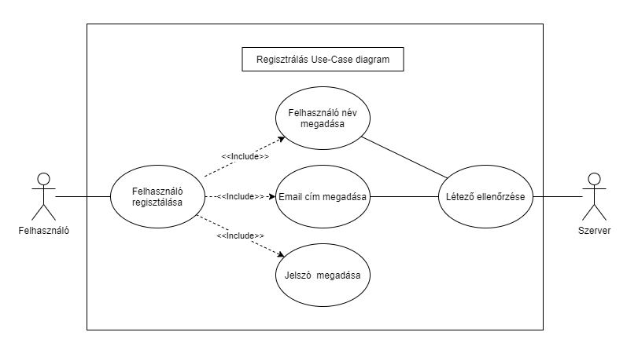
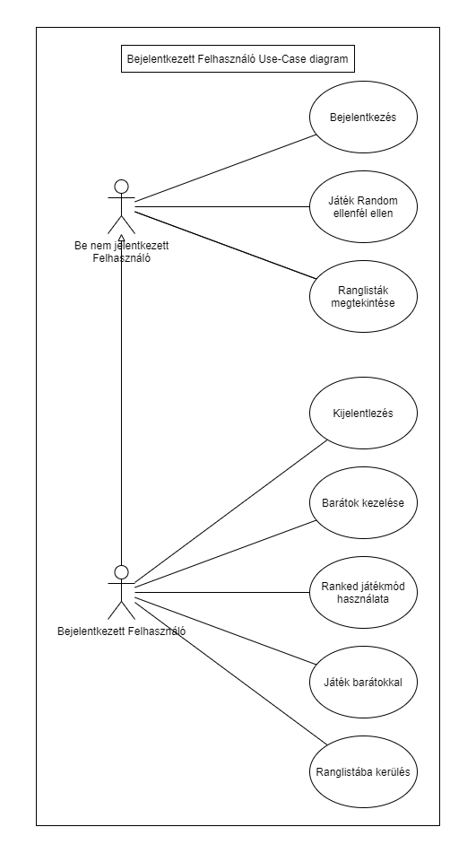
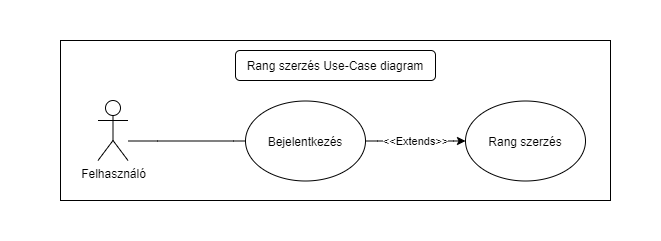
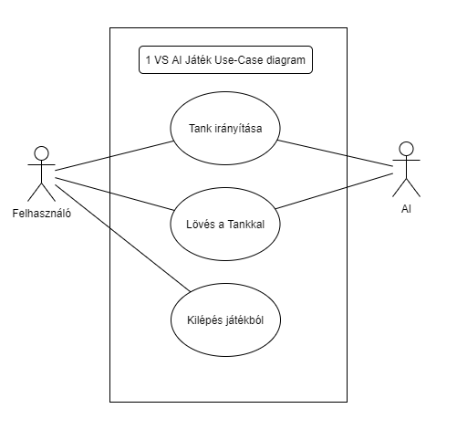
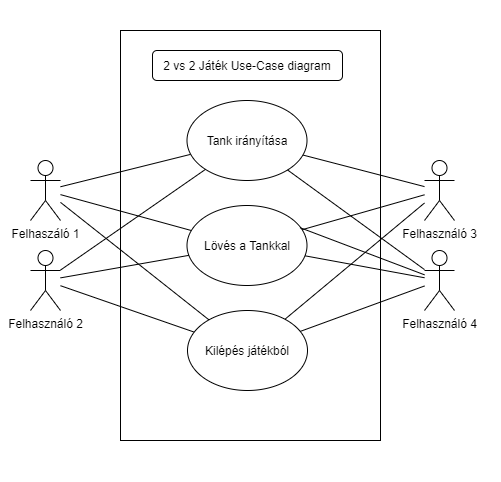
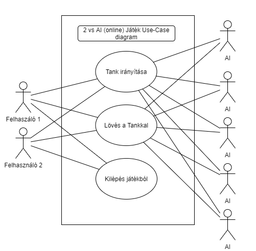
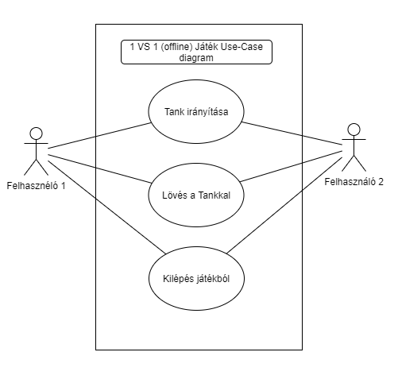
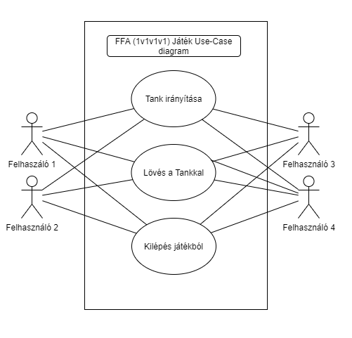

<h3>Csoport neve: SoftTech Games  
Feladat sorszáma: H3  
Feladat címe: Harmadik beadandó </h3>

&nbsp;

&nbsp;

&nbsp;

&nbsp;

<h1 align="center">Harmadik beadandó</h1>

&nbsp;

&nbsp;

&nbsp;

&nbsp;

Gyakorlatvezető:

<h2 align="center">Krizsán Zoltán</h2>

| Sándor Máté    | AQUSP7          | samate113@gmail.com     |
|:--------------:|:---------------:|:------------------------------------:|
| Szabó Martin   | JDVK0Y          | szabo.martin@student.uni-miskolc.hu    |
| Balázs Tamás   | HM23GB          | balazs.tamas@student.uni-miskolc.hu    |
| Ádám Róbert    | G3LZYU          | adam.robert@student.uni-miskolc.hu     |
| Bordás Dávid   | D2NGJO          | devidbordas@gmail.com   |

&nbsp;

&nbsp;

&nbsp;

2021.11.23

1, Bevezetés
=========
Ebben a dokumentumban a csapatunk által fejlesztés alatt álló applikáció részletes specifikációját közöljük. Az alábbiakban határozzuk meg a rendszer által nyújtott szolgáltatásokat, kitérünk a megbízhatóságra és a teljesítményre vonatkozó követelményekre is. Megtalálható még a dokumentumban a hardver és szoftver interfészek jellemzői, és a fejlesztés során alkalmazott szabványok is. Továbbá a dokumentációhoz tartozik egy szótár is.

&nbsp;

2, Áttekintés
====================
A játékunk célja elsősorban a szórakoztatás, valamint elődje az ismert online „AZ” nevű játék továbbfejlesztése. A mi játékunk egy ingyenesen letölthető, regisztrációhoz kötött alkalmazás mely kibővült funkciókat tartalmaz az online változatához képpest. A local multiplayer megmarad, két fő tud majd játszani egy billentyűzeten egymás ellen. Ami érdekesebb, hogy a mi játékunkban lesz online multiplayer is ahol a játékosok akár a barátaik vagy akár random játékosok ellen tudnak játszani. Az online rendszer úgy működne, hogy minden játékos a 10. osztályból indulna(division) a játéktudástól függően lehetne feljebb kerülni egészen az első osztályig. Minél magasabb osztályban vagy annál jobb jutalmakat kapsz. Lesz egy bizonyos játékbeli pénz melynek neve Tcoin lesz. Ilyet gyűjthetnek a játékosok különböző objectivek teljesítésével és a heti teljesítményüket is jutalmazni fogjuk Tcoinnal valamint loot boxokkal.

Az alkalmazás legfontosabb funkciói:
<ul>
  <li>a regisztrált felhasználók nyilvántartása
  <li>a rangsor felállítása és nyilvántartása a felhasználók között
  <li>a felhasználói jogosultságok ellenőrzése
</ul>
  
Korlátozások:
<ul>
  <li>a játék elsősorban csak Windows asztali számítógépen lesz elérhető
  <li>regisztráció nélkül csak alapkiegészítőkkel élvezhetik a játékmenetet, a játék többi része nem használható (ransorba bekerülés, skinek, Tcoin)
  <li>a regisztrációhoz és az alkalmazás letöltéséhez internet kapcsolat szükséges
  <li>a regisztráció során választott jelszónak erősnek kell lennie (min. 8 karaktert, kis- és nagybetűt, valamint számot kell tartalmaznia)
</ul>
  
Feltételezések és függőségek:
<ul>
  <li>feltételezzük, hogy a felhasználó a játék használatához szükséges alapvető készségekkel rendelkezik
  <li>valószínűsítjük, hogy a felhasználók és az érdeklődők rendelkeznek a program használatához szükséges eszközökkel (pl. PC, keyboard)
  <li>a user-nek kell legalább a letöltéshez és a regisztrációhoz gondoskodnia internethozzáférésről
</ul>
  
A követelmények csoportosításának szempontjai:
<ul>
  <li>termék letöltése
  <li>regisztráció
  <li>single player mód használata
  <li>multiplayer mód használata
  <li>jogszabályi követelmények
</ul>

&nbsp;

3, Use-Case diagramok
======================
Ebben a bizonyos pontban összefoglaljuk a programunk fő Use-Case-eit. Ezeknek kifejezetten nagy fontossága van mninden programban, beleértve a miénket is. Ezért kifejezetten sok részletre bontottuk az egyszerű átláthatóság elérése érdekében.

Bejelentkezés Use-Case diagram
==============================

Felhasználó (Actor)
-------------------
Olyan személy, aki jogosult navigálni a játékon belül, valamint abba be és ki lépni.

Felhasználó azonosítása (Use-Case)
----------------------------------
A felhasználó azonosítása bejelentkezés segítségével.

* Prekondíciók: Be nem jelentkezett Felhasználó
* Postkondíciók: Bejelentkezés miatt több funkció válik elérhetővé.
* Szokásos működés (Main Flow): Bejelentkezés fiókba.
* Alternatív esetek (Alternate Flows): Név, vagy a hozzá kötött jelszó nem található vagy nem megfelelő.
* Kivételes esetek: Internet/szerver probléma.

Jelszó megadása (Use-Case)
--------------------------
A felhasználó azonosításához szükséges jelszó megadása

* Prekondíciók: Létező azonosító megadva
* Postkondíciók: Bejelentkezés a fiókba.
* Szokásos működés (Main Flow): Bejelentkezés a fiókba helyes jelszó megadásával.
* Alternatív esetek (Alternate Flows): Helytelen jelszó sikertelen bejelentkezés.
* Kivételes esetek: Internet/szerver probléma.

Elfelejtett jelzó kezelése (Use-Case)
-------------------------------------
Esetleges opció, arra az esetre ha a felhaszáló elfelejtette a fiókjának a jelszavát.

* Prekondíciók: A jelszó helytelen megadása.
* Postkondíciók: Új jelszó kérési foylamat elindult.
* Szokásos működés (Main Flow): Új jelszó kérési folyamat indítása.
* Alternatív esetek (Alternate Flows): 
* Kivételes esetek: Internet/szerver probléma.

&nbsp;

Bejelentkezett Felhasználó Use-Case diagram
==============================================

Be nem jelentkezett Felhasználó (Actor)
----------------------------------------
Olyan Felhasználó, aki még nincs azonosítva, tehát kevesebb jogosultága van a többi Felhasználóhoz képest.

Bejelentkezett Felhasználó (Actor)
---------------------------------------
Olyan Felhasználó, aki már túl van az azonosítás folyamatán és sikeresen bejelentkezett Fiókjába.

Bejelentkezés (Use-Case)
------------------------
Az a folyamat ami által a felhasználót azonosítani lehet.

* Prekondíciók: Be nem elentkezett Felhasználó.
* Postkondíciók: Felhasználó bejelentkezett.
* Szokásos működés (Main Flow): Bejelentkezés fiókba.
* Alternatív esetek (Alternate Flows): Sikertelen bejelentkezés.
* Kivételes esetek: Internet/szerver probléma.

Játék Random ellenfél ellen (Use-Case)
-------------------------
Játék indítása véletlenszerűen választott ellenfél ellen.

* Prekondíciók: -
* Postkondíciók: Játék elindult.
* Szokásos működés (Main Flow): A játék indul az ellenfél ellen.
* Alternatív esetek (Alternate Flows): Várakozás ellenfélre
* Kivételes esetek: Internet/szerver probléma.

Ranglisták megtekintése (Use-Case)
-----------------
A Ranked módok által létrejött ranglisták megtekintése

* Prekondíciók: Kapcsolat internethez.
* Postkondíciók: Ranglisták megjelentek.
* Szokásos működés (Main Flow): Megnyitja a ranglistát.
* Alternatív esetek (Alternate Flows): -
* Kivételes esetek: Internet/szerver probléma.

Kijelentkezés (Use-Case)
------------
Lehetőség arra, hogy a fehasználó kijelentkezzen fiókjából.

* Prekondíciók: Bejelentkezett Felhasználó.
* Postkondíciók: Kijelentkezett Felhasználó
* Szokásos működés (Main Flow): Felhasználó kijelentkeztetése.
* Alternatív esetek (Alternate Flows): -
* Kivételes esetek: -

Barátok kezelése (Use-Case)
-----------------
A barátok hozzáadására, törlésére és egyéb műveletek végzésére szolgál.

* Prekondíciók: Bejelentkezett Felhasználó
* Postkondíciók: Hozzáadott vagy törölt barát.
* Szokásos működés (Main Flow): Barátok hozzáadása, törlése, és kezelésének elérése.
* Alternatív esetek (Alternate Flows): -
* Kivételes esetek: Internet/szerver probléma.

Ranked játékmód használata
-----------
A Casual-al ellentétben a Ranked játékmód egy pont rendszer alapján választja a Felhasználó számára legideálisabb ellenfelet.

* Prekondíciók: Bejelentkezett Felhasználó, aki elérte a meghatározott szintet hogy részt vehessen Ranked játékokban.
* Postkondíciók: Ranked Játék indul, nyerés esetén pont nyerés, vesztés esetén pont veszteség.
* Szokásos működés (Main Flow): Amennyiben a Felhasználó elérte a meghatározott szintet ranked játékot indíthat más véletlenszerű ellenfelek ellen.
* Alternatív esetek (Alternate Flows): Egy üzenet jelenik meg hogy érje el a meghatározott szintet.
* Kivételes esetek: Internet/szerver probléma.

Ranglistába kerülés
-----------
A Ranked mód által nyert pontokból rangokat lehet elérni, ezzel jelezve a jobbik játékos magasabb rangját.

* Prekondíciók: Bejelentkezett felhasználó, aki már játszott legalább egy Ranked játékot.
* Postkondíciók: A Ranglistán látható helyezés.
* Szokásos működés (Main Flow): A Ranked játékmód után szerzett vagy vesztett pontok alapján nő, vagy csökken a játékos pontja és ezáltal a rangja is változhat.
* Alternatív esetek (Alternate Flows): Döntetlen, vagy hamar megszakadt játék esetén a pont nem változik.
* Kivételes esetek: Internet/szerver probléma.

Játék barátokkal
----------
Ez lehetővé teszi hogy a Felhasználó barátlistán található elérhető játékosokkal (Felhasználókkal) létesítsen 2vAI,1v1,2v2 vagy 2v2 Játékot.

* Prekondíciók: Bejelentkezett Felhasználó, legalább egy elérhető baráttal.
* Postkondíciók: Játék indul Barát(ok)al.
* Szokásos működés (Main Flow): A Felhasználónak lehetősége nyílik töb különféle játékot indítani barátokkal.
* Alternatív esetek (Alternate Flows): A Felhasználónak egyik barátja sem elérhető, vagy egy sincs.
* Kivételes esetek: Internet/szerver probléma.

&nbsp;

Rang szerzése Use-Case diagram.
===============================

Felhasználó
------------
Olyan felhasználó aki még nincs azonosítva.

Bejelentkezés (Use-Case)
------------------------
Az a folyamat ami által a felhasználót azonosítani lehet.

* Prekondíciók: Be nem elentkezett Felhasználó.
* Postkondíciók: Felhasználó bejelentkezett.
* Szokásos működés (Main Flow): Bejelentkezés fiókba.
* Alternatív esetek (Alternate Flows): Sikertelen bejelentkezés.
* Kivételes esetek: Internet/szerver probléma.

Rang szerzés (Use-Case)
------------------------
A folyamat ahol a bejelentkezett felhasználó rangot tud elérni.

* Prekondíciók: Azonosított/bejelentkezett Felhasználó. 10 játék CASUAL módban.
* Postkondíciók: Megszerzett Rang.
* Szokásos működés (Main Flow): A Ranked játékmód választásával nyeréskor a nyertes Felhasználó Rangja nő, a vesztes Felhasználóé csökken.
* Alternatív esetek (Alternate Flows): -
* Kivételes esetek: Internet/szerver probléma.

&nbsp;

1 VS 1 (offline) Játék Use-Case diagram
=======================================

Felhasználó 1 (Actor)
----------------
Az a Felhasználó aki a Játékot futtató eszközén az ellenfél Felhasználóval osztozkodik.

Felhasználó 2 (Actor)
---------------
Az a Felhasználó, aki az ellenfél Felhasználó eszközén osztozkodva közvetlenül játszik.

Tank irányítása (Use-Case)
------------
A tankok irányítása előre hátra jobbra és balra.

* Prekondíciók: Játékba betöltés.
* Postkondíciók: A Tank elmozdult.
* Szokásos működés (Main Flow): A hozzá megfelelő gomb lenyomásával modul a Tank valamelyik irányba.
* Alternatív esetek (Alternate Flows): A falhoz érve nem tud tovább haladmi a Tank.
* Kivételes esetek:-

Lövés a Tankal (Use-Case)
----------------
A Tankokkal lehet lőni egy golyót amivel érintezéskor felrobbannak az érintett Tank.

* Prekondíciók: Játékba betöltés.
* Postkondíciók: A golyó elhagyja a tankot.
* Szokásos működés (Main Flow): Az erre kijelölt gomb megnyomása után a golyó elhagyja a tankot.
* Alternatív esetek (Alternate Flows): Még nem lehet lőni hiszen csak meghatározott időközönként lehet lőni.
* Kivételes esetek:-

Kilépés a játékból (Use-Case)
------------------
A játék megszakítására és leállítására mindkét felhasználónak lehetősége van.

* Prekondíciók: Játékba betöltés.
* Postkondíciók: Kezdőképernyőre lépés.
* Szokásos működés (Main Flow): Az erre kijelölt felületen ennek az opciónak a választásával kiléphet az egyik felhasználó, mivel ez egy eszközön történik ezért mindkét Felhasználó a tálcát látja.
* Alternatív esetek (Alternate Flows): -
* Kivételes esetek:-

&nbsp;

1 VS AI Játék Use-Case diagram
====================

Felhasználó(Actor)
---------
Olyan személy, aki jogosult navigálni a játékon belül, valamint abba be és ki lépni.

AI (Actor)
-----
AI - Artifical Inteligence, magyarul Mesterséges inteligencia. Az AI tankokat mesterséges inteligencia irányítja, a Felhasználónál kevesebb joga van.

Tank irányítása (Use-Case)
------------
A tankok irányítása előre hátra jobbra és balra.

* Prekondíciók: Játékba betöltés.
* Postkondíciók: A Tank elmozdult.
* Szokásos működés (Main Flow): A hozzá megfelelő gomb lenyomásával modul a Tank valamelyik irányba.
* Alternatív esetek (Alternate Flows): A falhoz érve nem tud tovább haladmi a Tank.
* Kivételes esetek: -

Lövés a Tankal (Use-Case)
----------------
A Tankokkal lehet lőni egy golyót amivel érintezéskor felrobbannak az érintett Tank.

* Prekondíciók: Játékba betöltés.
* Postkondíciók: A golyó elhagyja a tankot.
* Szokásos működés (Main Flow): Az erre kijelölt gomb megnyomása után a golyó elhagyja a tankot.
* Alternatív esetek (Alternate Flows): Még nem lehet lőni hiszen csak meghatározott időközönként lehet lőni.
* Kivételes esetek: -

Kilépés a játékból (Use-Case)
------------------
A Felhasználónak joga van akármikor leállítani a játékot, erre segít a kilépés a játékból opció.

* Prekondíciók: Játékba betöltés.
* Postkondíciók: Kezdőképernyőre lépés.
* Szokásos működés (Main Flow): Az erre kijelölt felületen ennek az opciónak a választásával kiléphet a felhasználó.
* Alternatív esetek (Alternate Flows): -
* Kivételes esetek: 

&nbsp;

2 VS 2 Játék Use-Case diagram

Felhasználó 1 (Actor)
----------------
Egy olyan felahasználó aki 2v2 játékot indított és azon belül az online opciót választotta,
vagy amennyiben a játékot split módban indította lehetősége van csapattársával osztozni saját eszközén közvetlenül.
A játékban az "A" csapatban van.

Felhasználó 2 (Actor)
---------------
Egy olyan felahasználó aki 2v2 játékot indított és azon belül az online opciót választotta,
vagy a csapattársa eszközén játszik.
A játékban az "A" csapatban van.

Felhasználó 3 (Actor)
----------------
Egy olyan felahasználó aki 2v2 játékot indított és azon belül az online opciót választotta,
vagy amennyiben a játékot split módban indította lehetősége van csapattársával osztozni saját eszközén közvetlenül.
A játékban az "B" csapatban van.

Felhasználó 4 (Actor)
---------------
Egy olyan felahasználó aki 2v2 játékot indított és azon belül az online opciót választotta,
vagy a csapattársa eszközén játszik.
A játékban az "B" csapatban van.

Tank irányítása (Use-Case)
------------
A tankok irányítása előre hátra jobbra és balra.

* Prekondíciók: Játékba betöltés.
* Postkondíciók: A Tank elmozdult.
* Szokásos működés (Main Flow): A hozzá megfelelő gomb lenyomásával modul a Tank valamelyik irányba.
* Alternatív esetek (Alternate Flows): A falhoz érve nem tud tovább haladmi a Tank.
* Kivételes esetek: Internet/szerver probléma.

Lövés a Tankal (Use-Case)
----------------
A Tankokkal lehet lőni egy golyót amivel érintezéskor felrobbannak az érintett Tank.

* Prekondíciók: Játékba betöltés.
* Postkondíciók: A golyó elhagyja a tankot.
* Szokásos működés (Main Flow): Az erre kijelölt gomb megnyomása után a golyó elhagyja a tankot.
* Alternatív esetek (Alternate Flows): Még nem lehet lőni hiszen csak meghatározott időközönként lehet lőni.
* Kivételes esetek: Internet/szerver probléma.

Kilépés a játékból (Use-Case)
------------------
A Felhasználónak joga van akármikor leállítani a játékot, erre segít a kilépés a játékból opció.

* Prekondíciók: Játékba betöltés.
* Postkondíciók: Kezdőképernyőre lépés.
* Szokásos működés (Main Flow): Az erre kijelölt felületen ennek az opciónak a választásával kiléphet bármelyik felhasználó.
* Alternatív esetek (Alternate Flows): Ha egy csapatban már csak egy Felhasználó van életben és ő kilép, az ellenfél csapat nyer.
* Kivételes esetek: Internet/szerver probléma.

&nbsp;

2 VS AI (offline) Játék Use-Case diagram
======================

Felhasználó 1 (Actor)
----------------
Az a Felhasználó aki a Játékot futtató eszközén a csapattárs Felhasználóval osztozkodik.

Felhasználó 2 (Actor)
---------------
Az a Felhasználó, aki az csapattárs Felhasználó eszközén osztozkodva közvetlenül játszik.

AI (Actor)
-----
AI - Artifical Inteligence, magyarul Mesterséges inteligencia. Az AI tankokat mesterséges inteligencia irányítja, a Felhasználónál kevesebb joga van. Ebben az esetben több ellen 

Tank irányítása (Use-Case)
------------
A tankok irányítása előre hátra jobbra és balra.

* Prekondíciók: Játékba betöltés.
* Postkondíciók: A Tank elmozdult.
* Szokásos működés (Main Flow): A hozzá megfelelő gomb lenyomásával modul a Tank valamelyik irányba.
* Alternatív esetek (Alternate Flows): A falhoz érve nem tud tovább haladmi a Tank.
* Kivételes esetek: -

Lövés a Tankal (Use-Case)
----------------
A Tankokkal lehet lőni egy golyót amivel érintezéskor felrobbannak az érintett Tank.

* Prekondíciók: Játékba betöltés.
* Postkondíciók: A golyó elhagyja a tankot.
* Szokásos működés (Main Flow): Az erre kijelölt gomb megnyomása után a golyó elhagyja a tankot.
* Alternatív esetek (Alternate Flows): Még nem lehet lőni hiszen csak meghatározott időközönként lehet lőni.
* Kivételes esetek: Internet/szerver probléma.

Kilépés a játékból (Use-Case)
------------------
A Felhasználónak joga van akármikor leállítani a játékot, erre segít a kilépés a játékból opció.

* Prekondíciók: Játékba betöltés.
* Postkondíciók: Kezdőképernyőre lépés.
* Szokásos működés (Main Flow): Az erre kijelölt felületen ennek az opciónak a választásával kiléphet a felhasználó.
* Alternatív esetek (Alternate Flows): -
* Kivételes esetek: Internet/szerver probléma.

2 VS AI (online) Játék Use-Case diagram
======================

Felhasználó 1 (Actor)
----------------
Az a Felhasználó aki egy 2vAI online Játékot indított hamarabb mint a másik Felhasználó, így ez a Felhaszáló lett a fő felhazsnál és a host.

Felhasználó 2 (Actor)
---------------
Az a Felhasználó, aki 2VAI online Játékot indított az első Felhasználó után, így ő csatlakozott a másik Felhasználó által Host-tolt szerverre.

AI (Actor)
-----
AI - Artifical Inteligence, magyarul Mesterséges inteligencia. Az AI tankokat mesterséges inteligencia irányítja, a Felhasználónál kevesebb joga van. Ebben az esetben több ellen 

Tank irányítása (Use-Case)
------------
A tankok irányítása előre hátra jobbra és balra.

* Prekondíciók: Játékba betöltés.
* Postkondíciók: A Tank elmozdult.
* Szokásos működés (Main Flow): A hozzá megfelelő gomb lenyomásával modul a Tank valamelyik irányba.
* Alternatív esetek (Alternate Flows): A falhoz érve nem tud tovább haladmi a Tank.
* Kivételes esetek: Internet/szerver probléma.

Lövés a Tankal (Use-Case)
----------------
A Tankokkal lehet lőni egy golyót amivel érintezéskor felrobbannak az érintett Tank.

* Prekondíciók: Játékba betöltés.
* Postkondíciók: A golyó elhagyja a tankot.
* Szokásos működés (Main Flow): Az erre kijelölt gomb megnyomása után a golyó elhagyja a tankot.
* Alternatív esetek (Alternate Flows): Még nem lehet lőni hiszen csak meghatározott időközönként lehet lőni.
* Kivételes esetek: Internet/szerver probléma.

Kilépés a játékból (Use-Case)
------------------
A Felhasználónak joga van akármikor kilépni a játékból, azonban a Játék nem áll le, ha a Host lép le Host Migration jön létre.

* Prekondíciók: Játékba betöltés.
* Postkondíciók: Kezdőképernyőre lépés.
* Szokásos működés (Main Flow): Az erre kijelölt felületen ennek az opciónak a választásával kiléphet a felhasználó.
* Alternatív esetek (Alternate Flows): -
* Kivételes esetek: Internet/szerver probléma.

&nbsp;

1 VS 1 (online) Játék Use-Case diagram
=======================================

Felhasználó 1 (Actor)
----------------
Az a Felhasználó aki az 1v1 Online Játékot hamarabb indította mint a másik Felhasználó, ezáltal ő lett a host.

Felhasználó 2 (Actor)
---------------
Az a Felhasználó, aki az 1v1 Online Játékot később indított mint a másik Felhasználó, ezáltal csatlakozott a másik Felhasználó.

Tank irányítása (Use-Case)
------------
A tankok irányítása előre hátra jobbra és balra.

* Prekondíciók: Játékba betöltés.
* Postkondíciók: A Tank elmozdult.
* Szokásos működés (Main Flow): A hozzá megfelelő gomb lenyomásával modul a Tank valamelyik irányba.
* Alternatív esetek (Alternate Flows): A falhoz érve nem tud tovább haladmi a Tank.
* Kivételes esetek: Internet/szerver probléma.

Lövés a Tankal (Use-Case)
----------------
A Tankokkal lehet lőni egy golyót amivel érintezéskor felrobbannak az érintett Tank.

* Prekondíciók: Játékba betöltés.
* Postkondíciók: A golyó elhagyja a tankot.
* Szokásos működés (Main Flow): Az erre kijelölt gomb megnyomása után a golyó elhagyja a tankot.
* Alternatív esetek (Alternate Flows): Még nem lehet lőni hiszen csak meghatározott időközönként lehet lőni.
* Kivételes esetek: Internet/szerver probléma.

Kilépés a játékból (Use-Case)
------------------
A játék megszakítására és leállítására mindkét felhasználónak lehetősége van. A kilépő Felhasználó által a másik Felhasználó nyeri a játékot.

* Prekondíciók: Játékba betöltés.
* Postkondíciók: Kezdőképernyőre lépés. Az aki ne lépett ki nyer.
* Szokásos működés (Main Flow): Az erre kijelölt felületen ennek az opciónak a választásával kiléphet mindkét Felhasználó.
* Alternatív esetek (Alternate Flows): -
* Kivételes esetek: Internet/szerver probléma.

&nbsp;

FFA Játék Use-Case diagram
==========================

Felhasználó 1 (Actor)
---------------
Egy felhasználó, aki elindított egy FFA játék keresést.

Felhasználó 2 (Actor)
---------------
Egy felhasználó, aki elindított egy FFA játék keresést.

Felhasználó 3 (Actor)
---------------
Egy felhasználó, aki elindított egy FFA játék keresést.

Felhasználó 4 (Actor)
---------------
Egy felhasználó, aki elindított egy FFA játék keresést.

Tank irányítása (Use-Case)
------------
A tankok irányítása előre hátra jobbra és balra.

* Prekondíciók: Játékba betöltés.
* Postkondíciók: A Tank elmozdult.
* Szokásos működés (Main Flow): A hozzá megfelelő gomb lenyomásával modul a Tank valamelyik irányba.
* Alternatív esetek (Alternate Flows): A falhoz érve nem tud tovább haladmi a Tank.
* Kivételes esetek: Internet/szerver probléma.

Lövés a Tankal (Use-Case)
----------------
A Tankokkal lehet lőni egy golyót amivel érintezéskor felrobbannak az érintett Tank.

* Prekondíciók: Játékba betöltés.
* Postkondíciók: A golyó elhagyja a tankot.
* Szokásos működés (Main Flow): Az erre kijelölt gomb megnyomása után a golyó elhagyja a tankot.
* Alternatív esetek (Alternate Flows): Még nem lehet lőni hiszen csak meghatározott időközönként lehet lőni.
* Kivételes esetek: Internet/szerver probléma.

Kilépés a játékból (Use-Case)
------------------
A játék megszakítására minden felhasználónak lehetsége van, azonban ezzel nem áll le a játék a többi játékosnak.

* Prekondíciók: Játékba betöltés.
* Postkondíciók: Játék elhagyása, kezdőképernyőre lépés.
* Szokásos működés (Main Flow): Az erre kijelölt felületen ennek az opciónak a választásával kiléphet bármelyik Felhasználó.
* Alternatív esetek (Alternate Flows): Ha csak két Felhasználó van és az egyik kilép, a másik nyer.
* Kivételes esetek: Internet/szerver probléma.

&nbsp;

* Prekondíciók: -
* Postkondíciók: -
* Szokásos működés (Main Flow): -
* Alternatív esetek (Alternate Flows): -
* Kivételes esetek: Internet/szerver probléma.

