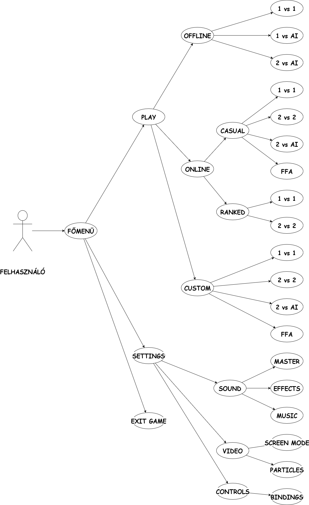

<h3>Csoport neve: SoftTech Games  
Feladat sorszáma: H1  
Feladat címe: Első beadandó </h3>

&nbsp;

&nbsp;

&nbsp;

&nbsp;

<h1 align="center">Első beadandó</h1>

&nbsp;

&nbsp;

&nbsp;

&nbsp;

Gyakorlatvezető:

<h2 align="center">Krizsán Zoltán</h2>

| Sándor Máté    | AQUSP7          | samate113@gmail.com     |
|:--------------:|:---------------:|:------------------------------------:|
| Szabó Martin   | JDVK0Y          | szabo.martin@student.uni-miskolc.hu    |
| Balázs Tamás   | HM23GB          | balazs.tamas@student.uni-miskolc.hu    |
| Ádám Róbert    | G3LZYU          | adam.robert@student.uni-miskolc.hu     |
| Bordás Dávid   | D2NGJO          | devidbordas@gmail.com   |

&nbsp;

&nbsp;

&nbsp;

2021.10.11

1, Bevezetés
=========
Ebben a dokumentumban a csapatunk által fejlesztés alatt álló applikáció részletes specifikációját közöljük. Az alábbiakban határozzuk meg a rendszer által nyújtott szolgáltatásokat, kitérünk a megbízhatóságra és a teljesítményre vonatkozó követelményekre is. Megtalálható még a dokumentumban a hardver és szoftver interfészek jellemzői, és a fejlesztés során alkalmazott szabványok is. Továbbá a dokumentációhoz tartozik egy szótár is.

&nbsp;

2, Áttekintés
====================
A játékunk célja elsősorban a szórakoztatás, valamint elődje az ismert online „AZ” nevű játék továbbfejlesztése. A mi játékunk egy ingyenesen letölthető, regisztrációhoz kötött alkalmazás mely kibővült funkciókat tartalmaz az online változatához képpest. A local multiplayer megmarad, két fő tud majd játszani egy billentyűzeten egymás ellen. Ami érdekesebb, hogy a mi játékunkban lesz online multiplayer is ahol a játékosok akár a barátaik vagy akár random játékosok ellen tudnak játszani. Az online rendszer úgy működne, hogy minden játékos a 10. osztályból indulna(division) a játéktudástól függően lehetne feljebb kerülni egészen az első osztályig. Minél magasabb osztályban vagy annál jobb jutalmakat kapsz. Lesz egy bizonyos játékbeli pénz melynek neve Tcoin lesz. Ilyet gyűjthetnek a játékosok különböző objectivek teljesítésével és a heti teljesítményüket is jutalmazni fogjuk Tcoinnal valamint loot boxokkal.

&nbsp;

3, A program funkciói
=====================
A következő alpont első részében a Tankies-hez kapcsolódó személyek által igénybe vehető funkciókat tárgyaljuk, a use-case ábra segít a felhasználó által elérhető opciók 
értelmezésében.

&nbsp;

&nbsp;

A Felhasználó ebben a diagramban az a személy, aki a játékot kezeli. A use-case diagram bemutatja a felhasználó lehetőségeit. a játék főmenüjébe érve az indítási folyamat elvégzése után.
A menüben egyszerű haladás érdekében egérrel bal klikk megnyomásával és billentyűzet nyilak és enter valamint escape billentyűket használva navigálhat, valamint minden menü bal felső sarkában egy vissza nyil található az egér használok menüben visszalépés érdekében.

&nbsp;

A Felhasználó a főmenübe érve három opcióval találkozik:

* PLAY
  * A PLAY gomb a játék indításához közelíti a felhasználót. Nem indítja azonnal a játékot, hiszen több opció közül kell választani a több játékmód miatt. 

* SETTINGS
  * A SETTINGS gomb a felhasználót egyenesen a beállítások menübe vezeti ahol a felhasználó különböző megszabott változtatásokat végezhet a játékon a játékélmény személyre szabása és javítása érdekében.

* EXIT GAME
  * Az EXIT GAME gomb leállítja a játék folyamatát a lehető legoptimálisabb módon, felszabadítva a játék által használt erőforrásokat.

&nbsp;

&nbsp;

Play opció választásával további két lehetőség jelenik meg a felhasználó kijelzőjén:

* ONLINE
  * Az ONLINE mód választásával internet kapcsolat elérése esetén a felhasználónak lehetősége van más játékosokkal játszani világ szerte.
* OFFLINE
  * Az OFFLINE mód választása esetén internet kapcsolat elérése nélkül is lehetősége nyílik játszani a felhasználónak.

&nbsp;

&nbsp;

ONLINE mód választása esetén további két lehetőség nyílik a felhasznáó számára_
* CASUAL
  * 
* RANKED
  * 

